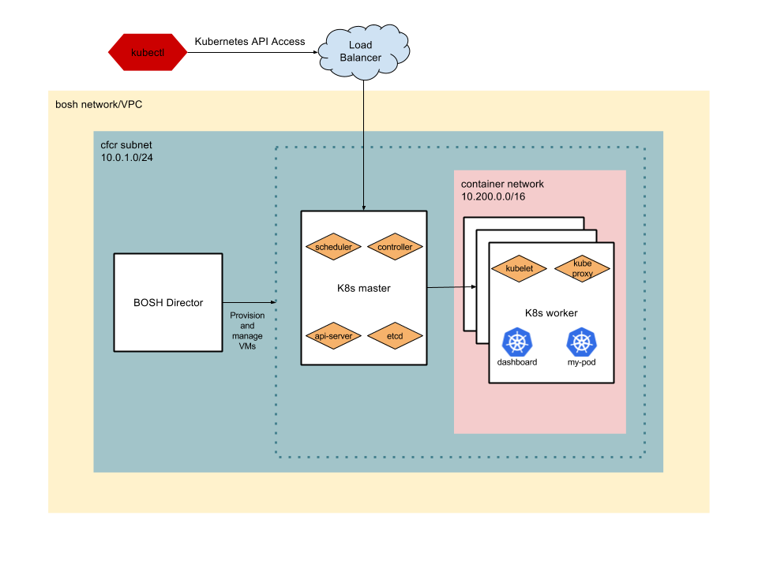
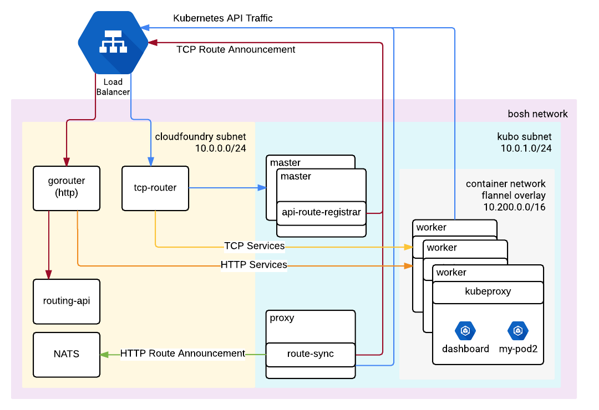

# kubo-deployment

Kubo is a [BOSH](https://bosh.io/) release for Kubernetes. It provides a solution for deploying and managing Kubernetes with BOSH

This repository contains the documentation and manifests for deploying [kubo-release](https://github.com/cloudfoundry-incubator/kubo-release) with BOSH.


**Slack**: #kubo on https://slack.cloudfoundry.org
**Pivotal Tracker**: https://www.pivotaltracker.com/n/projects/2093412

## CI Status

Build Kubo Release status [](https://ci.kubo.sh/pipelines/kubo-deployment)

### IaaS specific jobs

| Job | GCP with CF routing pipeline Status |GCP with load balancer status|vSphere status|
|---------|--------|--------|--------|
| Install BOSH | [](https://ci.kubo.sh/pipelines/kubo-deployment) | [](https://ci.kubo.sh/pipelines/kubo-deployment) | [](https://ci.kubo.sh/pipelines/kubo-deployment) |
| Deploy K8s | [](https://ci.kubo.sh/pipelines/kubo-deployment) | [](https://ci.kubo.sh/pipelines/kubo-deployment) | [](https://ci.kubo.sh/pipelines/kubo-deployment) |
| Run smoke tests | [](https://ci.kubo.sh/pipelines/kubo-deployment) | [](https://ci.kubo.sh/pipelines/kubo-deployment) | [](https://ci.kubo.sh/pipelines/kubo-deployment) |

See the [complete pipeline](https://ci.kubo.sh/pipelines/kubo-deployment) for more details. The CI pipeline definitions are stored in the [kubo-ci](https://github.com/pivotal-cf-experimental/kubo-ci) repository.

## Deploy CFCR 

### Prerequisites
Clone CFCR Repos:
These steps assume you have a [BOSH](http://bosh.io/) Director with a [cloud config](https://bosh.io/docs/cloud-config/) 
and [stemcell](http://bosh.io/stemcells) deployed to it.

### Instructions
1. Refer to the [latest release](https://github.com/cloudfoundry-incubator/kubo-release/releases/latest) version number, and replace 0.17.0 in the following instructions with the appropriate version number.
1. `git clone https://github.com/cloudfoundry-incubator/kubo-deployment.git && cd kubo-deployment && git checkout v0.17.0`
1. `wget https://github.com/cloudfoundry-incubator/kubo-release/releases/download/v0.17.0/kubo-release-0.17.0.tgz`
1. `bosh upload-release kubo-release-0.17.0.tgz`
1. `bosh deploy -d cfcr manifests/cfcr.yml`
1. `bosh -d cfcr run-errand apply-specs`
1. `bosh -d cfcr run-errand smoke-tests`
1. [Accessing CFCR cluster](#accessing-cfcr-cluster)

### Deploy development version of CFCR on [BOSH Lite](http://bosh.io/docs/bosh-lite/)
This will deploy a single master CFCR cluster. Assuming you have uploaded the [default cloud config](https://github.com/cloudfoundry/bosh-deployment/blob/master/warden/cloud-config.yml)
to the BOSH Lite director, the kubernetes master host is deployed to a static
IP: `10.244.0.34`.

1. `cd kubo-deployment`
1. `git clone https://github.com/cloudfoundry-incubator/kubo-release.git ../kubo-release`
1. Run bosh-lite deploy script `./bin/deploy_cfcr_lite`

## Accessing CFCR Cluster
After deploying the cluster, perform the following steps:

1. Create a load balancer for your IaaS that points to the kube-apiserver. If deploying CFCR with multiple masters, we recommend creating a TCP Load Balancer with healthchecks on port 8443. 
1. Login to the Credhub Server that stores the cluster's credentials:
```
credhub login 
```

2. Execute the `./bin/set_kubeconfig` script to configure `kubectl`, the Kubernetes command line interface:

```
$ ./bin/set_kubeconfig <director_name>/<deployment_name> https://**kubernetes_master_host**:**kubernetes_master_port**
```

>Note: You can currently find your kubernetes_master_host by running `terraform output -state=${kubo_terraform_state} master_lb_ip_address`

3. Verify that the settings have been applied correctly by listing the Kubernetes pods in the kubo-system namespace:
```
$ kubectl get pods --namespace=kube-system
```

If you have successfully configured kubectl, the output resembles the following:
```
NAME                                    READY     STATUS    RESTARTS   AGE
heapster-2736291043-9rw42               1/1       Running   0          2d
kube-dns-3329716278-dpdj0               3/3       Running   0          2d
kubernetes-dashboard-1367211859-jq9mw   1/1       Running   0          2d
monitoring-influxdb-564852376-67fdd     1/1       Running   0          2d
```

## Documentation
Review the following documentation to get a better understanding of Cloud Foundry and Kubernetes architectures.

* [Cloud Foundry docs](https://docs.cloudfoundry.org/concepts/architecture/)
* [Kubernetes Overview](https://thenewstack.io/kubernetes-an-overview/)
* [Kubernetes architecture docs](https://github.com/kubernetes/community/blob/master/contributors/design-proposals/architecture.md)

## Contributing

For instructions on contributing to this project, please see [CONTRIBUTING.md](CONTRIBUTING.md).

## Troubleshooting

Please refer to the [troubleshooting guide](https://docs-cfcr.cfapps.io/managing/troubleshooting/) to look for solutions to the most common issues.

## Design

### Components

A specialized BOSH director manages the virtual machines for the Kubo instance. This involves VM creation, health checking, and resurrection of missing or unhealthy VMs. The BOSH director includes CredHub and PowerDNS to handle certificate generation within the kubo clusters. Additionally, Credhub is used to store the auto-generated passwords.

### Networking Topology - using IaaS Load Balancers



The nodes that run the Kubernetes API (master nodes) are exposed through an IaaS specific load balancer. The load balancer will have an external static IP address that is used as a public and internal endpoint for traffic to the Kubernetes API.

Kubernetes services can be exposed using a second IaaS specific load balancer which forwards traffic to the Kubernetes worker nodes.

### Networking Topology - using Cloud Foundry routing



The nodes that run the Kubernetes API (master nodes) register themselves with the Cloud Foundry TCP router. The TCP Router acts as both public and internal endpoint for the Kubernetes API to route traffic to the master nodes of a Kubo instance. All traffic to the API goes through the Cloud Foundry TCP router and then to a healthy node. 

The Cloud Foundry subnet must be able to route traffic directly to the Kubo subnet. It is recommended to keep them in separate subnets when possible to avoid the BOSH directors from trying to provision the same addresses. This diagram specifies CIDR ranges for demonstration purposes as well as a public router in front of the Cloud Foundry gorouter and tcp-router which is typical.

## Glossary

- Kubo - Kubernetes on BOSH
- [Bastion](https://en.wikipedia.org/wiki/Jump_server) - A server within the kubo network that provides secure access to kubo.
- Kubo environment Configuration - Folder that contains all configuration files needed to deploy BOSH and Kubo, as well as all 
  configuration files that are generated during deployment. Also called `<KUBO_ENV>`
- Creds - Credentials that are generated during BOSH deployment process and stored in `<KUBO_ENV>/creds.yml`
- Service - stands for [K8s service](https://kubernetes.io/docs/user-guide/services), which represents a logical collection 
  of Kubernetes pods and a way to access them without needing information about the specific pods
