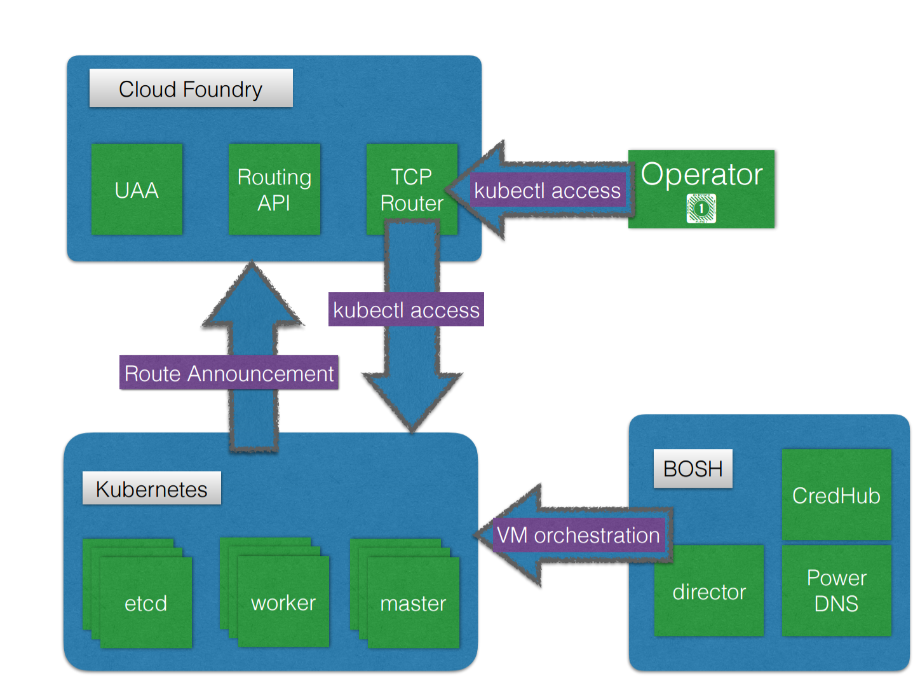

# kubo-deployment

Kubo is a [BOSH](https://bosh.io/) release for Kubernetes. It provides a solution for deploying and managing Kubernetes with BOSH alongside [Cloud Foundry](https://cloudfoundry.org). 

This repository contains the documentation, automation, and manifests for deploying [kubo-release](https://github.com/pivotal-cf-experimental/kubo-release) with BOSH.

## Table of Contents

- [Design](#design)
- [Glossary](#glossary)
- [Installation Guides](#installation)
- [Troubleshooting](#troubleshooting)
- [Contribution](#contributing)

## Design

### Components



Kubo depends on Cloud Foundry to perform routing to the Kubernetes cluster. The Kubo deployment is responsible for announcing these routes to the Cloud Foundry Routing API. A specialized BOSH director manages the virtual machines for the Kubo instance which handles VM creation, health checking, and resurrection of missing or unhealthy VMs. The BOSH director includes CredHub and PowerDNS to handle certificate generation within the kubo clusters. Additionally, Credhub is used to store the autogenerated passwords.

Kubernetes applications deployed to a Kubo instance are not currently exposed to the outside world but may follow the same pattern of utilizing the Cloud Foundry routing infrastructure in the future.

### Networking Topology


The nodes that run the Kubernetes API (master) register themselves with the Cloud Foundry TCP router. The TCP Router acts as both public and internal endpoint for the Kubernetes API to route traffic to the master nodes of a Kubo instance. All traffic to the API goes through the Cloud Foundry TCP router and then to a healthy node. 

The Cloud Foundry subnet must be able to route traffic directly to the Kubo subnet. It is recommended to keep them in separate subnets when possible to avoid the BOSH directors from trying to provision the same addresses. This diagram specifies CIDR ranges for demonstration purposes as well as a public router in front of the Cloud Foundry gorouter and tcp-router which is typical.

## Glossary

- Kubo - Kubernetes on BOSH
- KuBOSH - BOSH with UAA, Credhub and PowerDNS
- [Bastion](https://en.wikipedia.org/wiki/Jump_server) - A server within the kubo network that provides secure access to kubo.
- BOSH environment Configuration - Folder that contains all configuration files needed to deploy KuBOSH and Kubo, as well as all 
  configuration files that are generated during deployment. Also called `<BOSH_ENV>`
- Creds - Credentials that are generated during KuBOSH deployment process and stored in `<BOSH_ENV>/creds.yml`
- Service - stands for [K8s service](https://kubernetes.io/docs/user-guide/services), which represents a logical collection 
  of Kubernetes pods and a way to access them without needing information about the specific pods

## Installation

Please choose the guide below that matches your requirements

1. Deploy Kubo from scratch with an open source Cloud Foundry installation on Google Cloud Platform - [guide](docs/guides/gcp-oss-cf)
1. Deploy Kubo with an existing Pivotal Cloud Foundry installation - [guide](docs/guides/gcp-pcf)
1. Deploy Kubo step by step, allowing for customization - [guide](docs/guides/customized-installation.md)

## Accessing Kubernetes dashboard

1. Get the NodePort for the Kubernetes dashboard service

   ```
   kubectl describe service kubernetes-dashboard --namespace=kube-system
   ```

1. Get the IP address of one of the Kubernetes worker nodes

   ```
   bosh-cli -e kube vms
   ```

1. Setup [sshuttle](https://github.com/apenwarr/sshuttle) from your local machine to your KuBOSH Director

   ```
   sshuttle -r <local machine IP address> <KuBOSH Subnet CIDR>
   ```

1. View the Kubernetes dashboard from your browser at `<worker node IP>:<NodePort>`

## Delete resources

### Delete Kubernetes Cluster

You can use the BOSH cli to delete your kubernetes deployment

```
bosh-cli -e kube -d kube delete-deployment
```

### Delete KuBOSH Director

Use the following script to delete your KuBOSH director

```
bin/destroy_bosh ~/kubo-env/kube ~/kubo-env/kube/service_account.json
```

## Troubleshooting

Please refer to the [troubleshooting guide](docs/troubleshooting.md) to look for solutions to the most common issues. 

## Contributing

For instructions on contributing to this project, please see [CONTRIBUTING.md](CONTRIBUTING.md).
